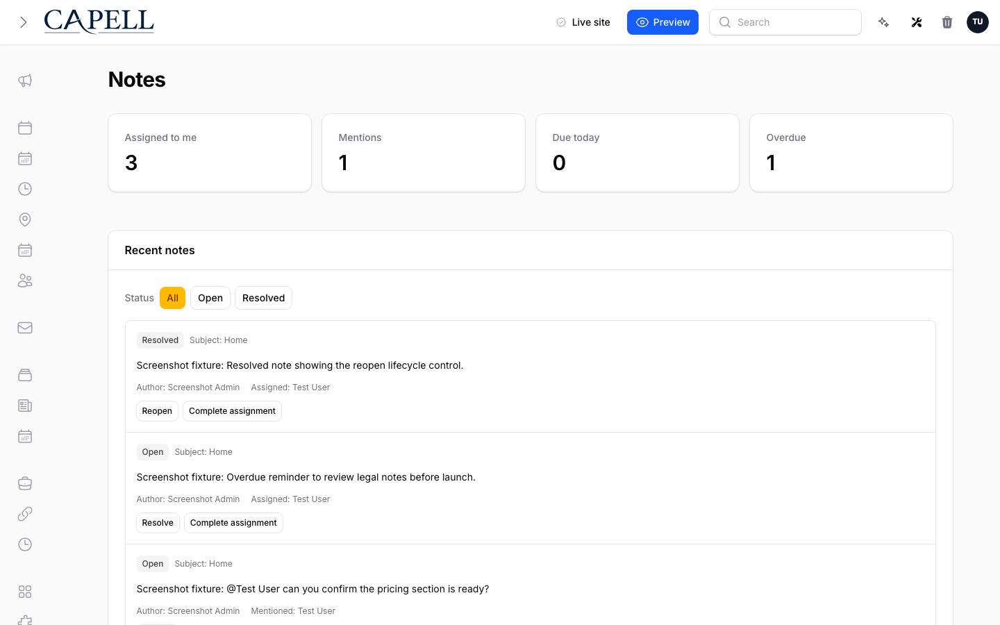

# Notes

<!-- prettier-ignore-start -->

## What This Plugin Adds

Notes is an **Available**, **Schema-owning** Capell package in the **Capell Engagement & CRM** product group. It ships as `capell-app/notes` and extends these surfaces: admin.

Notes adds private record notes with assignments, mentions, reminders, completion state, and an inbox for work needing attention.

Admin users can add a note from supported records, assign colleagues, mention people, set reminders, and work through their Notes inbox.

Status details:

- Status: Available
- Tier: free
- Bundle: engagement-crm
- Composer package: `capell-app/notes`
- Namespace: `Capell\Notes`
- Theme key: not applicable

## Why It Matters

**For developers:** Note creation, visibility, assignment, reminders, and notifications are split into Actions behind a reusable Notes manager.

**For teams:** Editors can coordinate follow-up beside the record being discussed without exposing internal notes on the public site.

## Screens And Workflow

Screenshot contract: `docs/screenshots.json`.

- User-menu notes item with attention badge (admin, required evidence).
- Notes inbox page (admin, required evidence).
- Record-level Add note modal (admin, required evidence).
- Empty notes inbox state (admin, required evidence).
- Notes inbox with assigned, mentioned, and lifecycle controls (admin, supplementary evidence).
- Notes inbox page with admin sidebar menu open (admin, supplementary evidence).

## Technical Shape

### Service providers

- `Capell\Notes\Providers\NotesServiceProvider`
- `Capell\Notes\Providers\ConsoleServiceProvider`
- `Capell\Notes\Providers\AdminServiceProvider`

### Config files

- `packages/notes/config/capell-notes.php`

### Migrations

- `packages/notes/database/migrations/2026_05_10_190862_01_create_notes_tables.php`
- `packages/notes/database/migrations/2026_07_10_000002_encrypt_note_bodies.php`

### Models

- `Note`
- `NoteAssignment`
- `NoteMention`
- `NoteReminder`

### Filament classes

- `CreateNoteResourceHeaderActionExtender`
- `NotesInboxPage`

### Policies

- `NotePolicy`

### Actions

- `AssignNoteUsersAction`
- `BuildSubjectNotesAction`
- `BuildUserAttentionCountsAction`
- `BuildUserInboxNotesAction`
- `CanViewNoteAction`
- `CompleteNoteAssignmentAction`
- `CreateNoteAction`
- `MarkNoteMentionsReadAction`
- `MentionNoteUsersAction`
- `PrepareEmptyNotesScreenshotInboxAction`
- `PruneNotesForDeletedParticipantAction`
- `PruneNotesForDeletedSubjectAction`
- `ReopenNoteAction`
- `ResolveNoteAction`
- `ResolveNoteParticipantsAction`
- `SendDueNoteReminderNotificationsAction`
- `SendNoteAssignmentNotificationsAction`
- `SendNoteMentionNotificationsAction`
- `UpsertNoteReminderAction`

### Data objects

- `CreateNoteData`
- `NoteReminderData`
- `UserAttentionCountData`

### Command signatures

- `capell:notes-demo`
- `capell:notes:send-due-reminders`

### Scheduled commands

- `capell:notes:send-due-reminders (everyFiveMinutes; package registered)`

### Console command classes

- `DemoCommand`
- `SendDueNoteRemindersCommand`

### Manifest contributions

- `admin-action-extender: Capell\Notes\Manifest\NotesAdminActionExtenderContribution`
- `admin-page: Capell\Notes\Manifest\NotesAdminPageContribution`
- `console-command: Capell\Notes\Manifest\NotesConsoleCommandsContribution`
- `health-check: Capell\Notes\Manifest\NotesHealthContribution`
- `model: Capell\Notes\Manifest\NotesModelsContribution`
- `scheduled-job: Capell\Notes\Manifest\NotesReminderScheduleContribution`

### Health checks

- `Capell\Notes\Health\NotesHealthCheck`

### Blade views

- `packages/notes/resources/views/filament/pages/notes-inbox.blade.php`

## Data Model

- Required tables: `notes`, `note_assignments`, `note_mentions`, `note_reminders`.
- Models: `Note`, `NoteAssignment`, `NoteMention`, `NoteReminder`.
- Migration files: `2026_05_10_190862_01_create_notes_tables.php`, `2026_07_10_000002_encrypt_note_bodies.php`.
- Migration impact: run host migrations through the package install flow before opening package surfaces.
- Deletion/retention behaviour: migrations declare cascade-on-delete relationships; no timed pruning or retention schedule is declared in `capell.json`.

## Install Impact

- Required packages: `capell-app/admin`.
- Admin navigation: declares `admin-page: NotesAdminPageContribution`; each Filament page or resource controls its own navigation visibility.
- Admin/editor extensions: `admin-action-extender: NotesAdminActionExtenderContribution`.
- Permissions: `View:Note`, `Resolve:Note`, `Reopen:Note`, `CompleteAssignment:Note`; access also governed by package policies: `NotePolicy`.
- Public routes: none declared.
- Database changes: package migrations are declared.
- Config: `config/capell-notes.php`.
- Settings: no package settings declared.
- Queues or schedules: scheduled commands `capell:notes:send-due-reminders (everyFiveMinutes; package registered)`.
- Cache tags: none declared.
- Commands: `capell:notes-demo`, `capell:notes:send-due-reminders`.

## Common Pitfalls

- Keep required Capell packages on compatible v4 releases: `capell-app/admin`.
- Run migrations before opening package resources or public routes.
- Review package configuration before production-like verification: `config/capell-notes.php`.
- Keep the host Laravel scheduler running so package-registered schedules can execute: `capell:notes:send-due-reminders (everyFiveMinutes; package registered)`.

## Troubleshooting

| Symptom | Likely cause | Check | Fix |
| --- | --- | --- | --- |
| Package surface is missing after install | Provider or manifest is not loaded | Confirm `capell.json`, package `composer.json`, and provider registration | Reinstall the package, refresh Composer autoload, and clear host caches |
| Admin screen or command fails on missing table | Package migrations have not run | Check the tables listed in `Data Model` | Run host migrations and rerun the focused package test |
| Background work does not run | Queue worker or declared schedule is not active | Check the jobs and scheduled commands listed in `Technical Shape` | Start the queue worker or host scheduler, then run the focused command or package test |

## Quick Start

1. Install the package: `composer require capell-app/notes`.
2. See it working: run `php artisan capell:notes-demo`.
3. Open the package admin surface at `/admin/notes` and confirm Notes is available.

## Next Steps

- [Package docs](docs/README.md)
- [Overview](docs/overview.md)
- [Admin guide](docs/admin-guide.md)
- Configuration files: [`config/capell-notes.php`](config/capell-notes.php).
- [Troubleshooting](#troubleshooting)
- [Screenshot contract](docs/screenshots.json)
- [Marketplace assets](docs/assets/marketplace/)
- [Capell content language plan](../../docs/CONTENT_LANGUAGE_PLAN.md)
- [Capell documentation design system](../../docs/DESIGN_SYSTEM.md)
- [Capell and package ERD notes](../../docs/erd/capell-and-package-erds.md)

<!-- prettier-ignore-end -->
